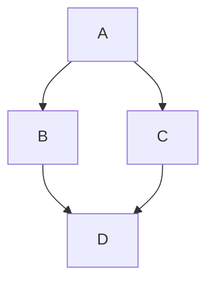

# Introduction

_the following section will just demonstrate docs capacity to render markdown content, and will be
removed in the future_

## Tabs

import Tabs from '@theme/Tabs';
import TabItem from '@theme/TabItem';

<Tabs>
  <TabItem value="apple" label="Apple" default>
    This is an apple 🍎
  </TabItem>
  <TabItem value="orange" label="Orange">
    This is an orange 🍊
  </TabItem>
  <TabItem value="banana" label="Banana">
    This is a banana 🍌
  </TabItem>
</Tabs>

## Code blocks

_Normal code blocks_

```cpp
#include <iostream>

int main()
{
  std::cout << "Hello World!" << std::endl;
  return 0;
}
```

_Code blocks with line numbers_

```cpp showLineNumbers
#include <iostream>

int main()
{
  std::cout << "Hello World!" << std::endl;
  return 0;
}
```

_Code blocks with line numbers and highlights_

```cpp showLineNumbers {2-4,6}
#include <iostream>

int main()
{
  std::cout << "Hello World!" << std::endl;
  return 0;
}
```

_Code blocks with filename_

```cpp title="source/Main.cpp"
#include <iostream>

int main()
{
  std::cout << "Hello World!" << std::endl;
  return 0;
}
```

## Admonitions

:::note
Some **content** with _Markdown_ `syntax`. Check [this api](#).
:::

:::tip
Some **content** with _Markdown_ `syntax`. Check [this api](#).
:::

:::info
Some **content** with _Markdown_ `syntax`. Check [this api](#).
:::

:::warning
Some **content** with _Markdown_ `syntax`. Check [this api](#).
:::

:::danger
Some **content** with _Markdown_ `syntax`. Check [this api](#).
:::

## Collapsibles

<details>
  <summary>Click to expand</summary>
  <p>This is the hidden content that will be revealed when the user clicks on the summary.</p>
</details>

## Math

Inline math: $E=mc^2$

Block math:
$$
\int_{-\infty}^{\infty} e^{-x^2} dx = \sqrt{\pi}
$$

## Mermaid



_This section will be removed in the future_
